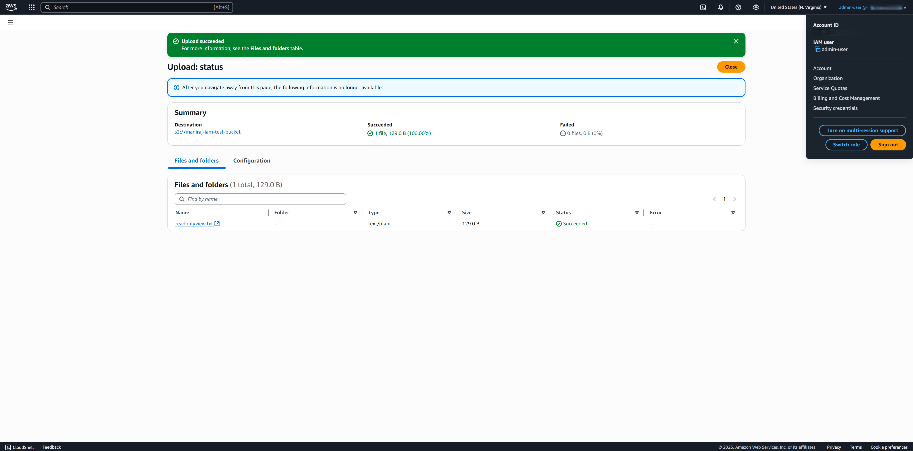
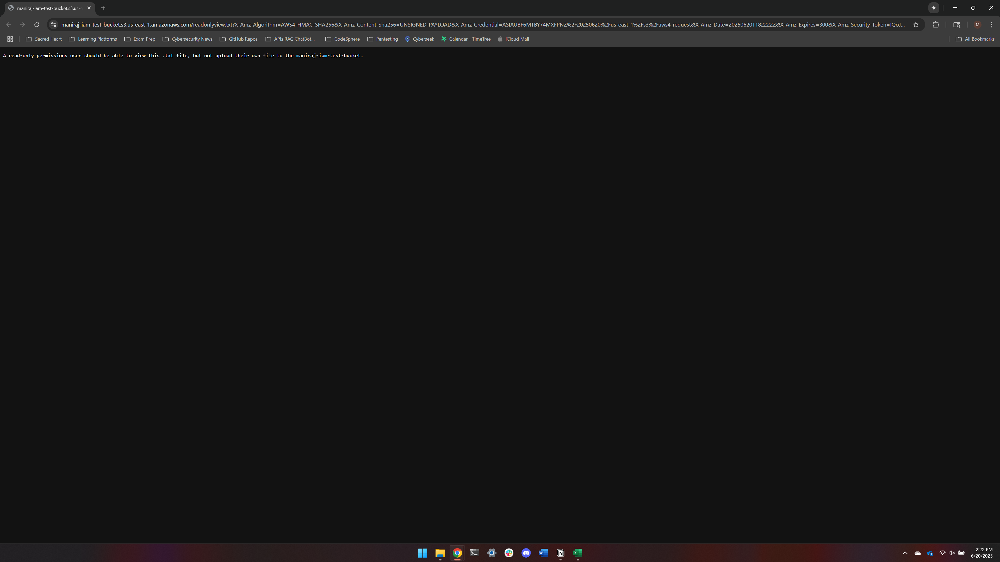
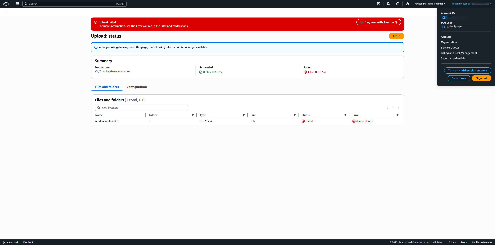

# IAM + S3 Permission Lab

This lab demonstrates AWS IAM access control by restricting and testing an IAM user's ability to interact with S3 resources.

---

## 🔐 Objective

- Create a private S3 bucket with test data from IAM user admin-user
- Create an IAM user with read-only access
- Validate:
  - ✅ User can view files
  - ❌ User cannot upload or delete files

---

## 🧪 Setup Summary

### ✅ S3 Bucket
- **Name**: `maniraj-iam-test-bucket`
- **Region**: `US East (N. Virginia) us-east-1`
- **Config**:
  - Private access only
  - Block all public access (enabled)
  - File uploaded: `readonly`

### ✅ IAM Users
#### 1. Admin User
- **Username**: `admin-user`
- **Policy Attached**: `Administrator Access`
#### 2. Read-Only User
- **Username**: `readonly-user`
- **Policy Attached**: `AmazonS3ReadOnlyAccess`

---

## 🧪 Test Results

### ✅ Admin User - Upload File (Success)
User accessed the S3 bucket and uploaded the `readonlyview.txt`.

### ✅ View File (Success)
User accessed the S3 bucket and viewed the uploaded `readonlyview.txt`.

### ❌ Read-Only User - Upload File (Blocked)
User attempted to upload `readonlyupload.txt` and was denied.

---

## 📂 Folder Contents

| File/Folder | Description |
|-------------|-------------|
| `screenshots/` | Visual proof of successful and failed actions |
| `iam-policy/` | (Optional) Custom JSON IAM policy for specific access |
| `README.md` | This documentation |

---

## 💡 Takeaways

- IAM policies are strictly enforced when properly configured
- AWS's managed `AmazonS3ReadOnlyAccess` policy is useful for read-only cases
- It's best practice to test IAM roles and policies in isolated environments before production

---

## 🧑‍💻 Author

**Maniraj Chahal**  
[GitHub](https://github.com/manirajchahal) • [LinkedIn](https://www.linkedin.com/in/manirajchahal)
