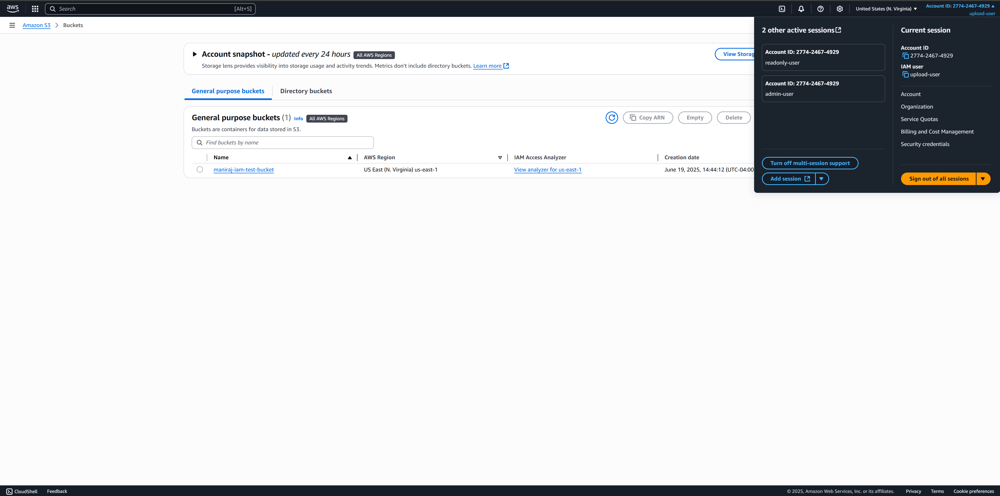
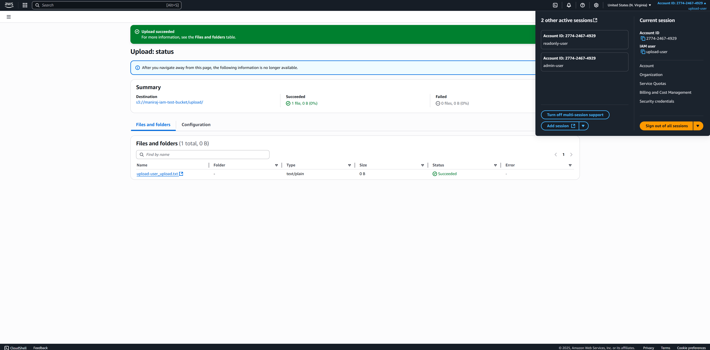
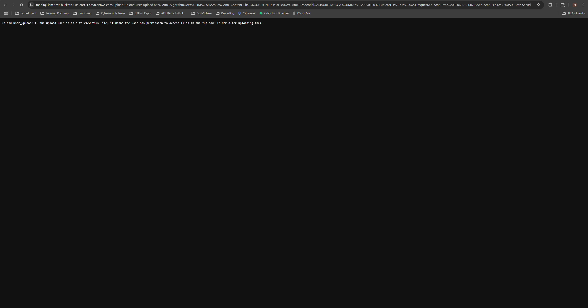
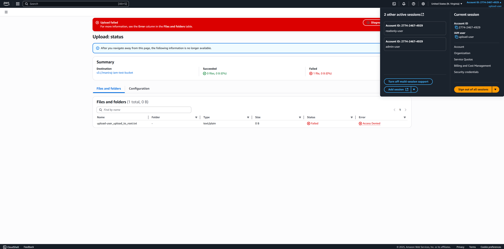
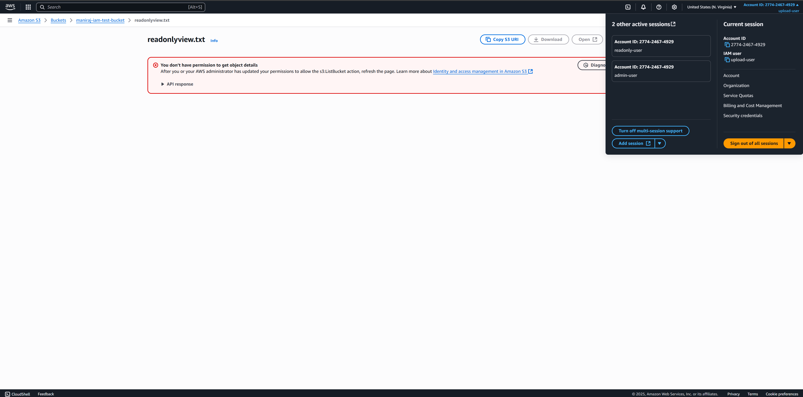

# IAM + S3 Permission Labs

This lab project demonstrates real-world AWS IAM access control by simulating multiple user scenarios interacting with a single private S3 bucket. The goal is to test and enforce fine-grained permission boundaries using AWS IAM and S3.

---

## 🔐 Lab Objective

- ✅ Create an S3 bucket with strict access control
- ✅ Test IAM users with limited and scoped permissions
- ✅ Validate that AWS IAM enforces permissions at object and prefix levels

---

## 📦 S3 Bucket Setup

- **Bucket Name:** `maniraj-iam-test-bucket`
- **Region:** US East (N. Virginia) `us-east-1`
- **Bucket Settings:**
  - Block all public access: ✅ Enabled
- **Folders:**
  - `/root`
  - `/upload/` (created by admin-user for upload-only testing)

---

## 🔹 Scenario 1: Read-Only User (`readonly-user`)

### 🎯 Objective
Allow a user to:
- ✅ View the bucket and all contents
- ❌ Upload or delete files

### ✅ Configuration
- **IAM User:** `readonly-user`
- **Policy Attached:** `AmazonS3ReadOnlyAccess` (AWS managed)

### 🧪 Test Results

| Action                    | Result   |
|---------------------------|----------|
| View file list            | ✅ Allowed |
| Read/view file            | ✅ Allowed |
| Upload file               | ❌ Denied  |
| Delete file               | ❌ Denied  |

### 🖼 Screenshots

### ✅ Admin User - Upload File (Success)
User accessed the S3 bucket and uploaded the `readonlyview.txt`.

### ✅ View File (Success)
User accessed the S3 bucket and viewed the uploaded `readonlyview.txt`.

### ❌ Read-Only User - Upload File (Blocked)
User attempted to upload `readonlyupload.txt` and was denied.

---

## 🔹 Scenario 2: Upload-Only to `/upload/` (`upload-user`)

### 🎯 Objective
Allow a user to:
- ✅ View only the `/upload/` folder and its contents
- ✅ Upload only to `/upload/`
- ❌ View or write anywhere else in the bucket

### ✅ Configuration
- **IAM User:** `upload-user`
- **Policy:** [`iam-policy/upload-only.json`](./iam-policy/upload-only.json)

### 🔐 IAM Policy Summary

- `s3:PutObject` → `upload/*` only  
- `s3:GetObject` → `upload/*` only  
- `s3:ListBucket` → scoped to prefixes: `""`, `upload/`, `upload/*`  
- `s3:ListAllMyBuckets` → so console can show buckets

### 🧪 Test Results

| Action                          | Result   |
|----------------------------------|----------|
| View bucket name                | ✅ Allowed |
| List `/upload/` folder          | ✅ Allowed |
| Upload file to `/upload/`       | ✅ Allowed |
| View file in `/upload/`         | ✅ Allowed |
| Upload file to root folder      | ❌ Denied  |
| View contents outside `/upload/`| ❌ Denied  |

### ✅ Upload User - View Bucket (Success)  
User logged in as `upload-user` and successfully accessed the `maniraj-iam-test-bucket`.

---

### ✅ Upload User - View `/upload/` Folder (Success)  
User accessed the `/upload/` folder inside the S3 bucket.

---

### ✅ Upload User - Upload File to `/upload/` (Success)  
User uploaded `upload-user_upload.txt` into the `/upload/` folder.

---

### ✅ Upload User - View Uploaded File (Success)  
User confirmed the uploaded file is accessible.

---

### ❌ Upload User - Upload to Root Folder (Blocked)  
User attempted to upload to the root directory (`/`) and was denied.

---

### ❌ Upload User - View Root Folder Contents (Blocked)  
User tried to list objects outside `/upload/` and received an access denied error.

## 📂 Folder Contents

| Path                        | Description                               |
|-----------------------------|-------------------------------------------|
| `iam-policy/upload-only.json` | Custom IAM policy for upload-only user    |
| `screenshots/`               | Visual proof of permissions and errors    |
| `README.md`                  | This documentation                        |

---

## 💡 Key Takeaways

- ✅ IAM policies are strictly enforced when configured properly
- ✅ `s3:ListAllMyBuckets` is required for the console to display buckets
- ✅ Fine-grained folder-level access is possible using S3 object prefixes
- ❌ Folders don’t technically exist in S3 — they're simulated by key prefixes
- ✅ Testing IAM scenarios in isolation is best practice before deployment

---
